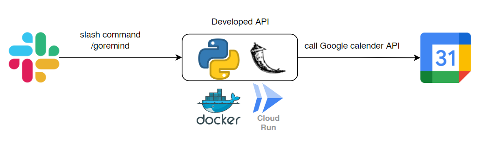

# Create a Google reminder from Slack slash command

This is a flask API to set a Google reminder



[windmark/google-reminder-api-wrapper](https://github.com/windmark/google-reminder-api-wrapper) are used to set the Google reminder.
Only "Create" command is available for API functions.

# Directory

```
|-Dockerfile
|-requirements.txt
└src
  └-main.py
```

# Docker file

Envoirment valiables have to be set for both usage in Google reminder and Slack slash command.
Fill your own cookie information and token in the Docker file. You can find the details from [here](https://github.com/windmark/google-reminder-api-wrapper#authorization)

```
FROM python:3
USER root

EXPOSE 8080:8080

# Envoirment variable for google reminder wrapper
ENV SID='xxxxxxxxxxxxxxxxxxx'
ENV HSID='xxxxxxxxxxxxxxxxxxx'
ENV SSID='xxxxxxxxxxxxxxxxxxx'
ENV APISID='xxxxxxxxxxxxxxxxxxx'
ENV SAPISID='xxxxxxxxxxxxxxxxxxx'
ENV authorization='xxxxxxxxxxxxxxxxxxx'
ENV key='xxxxxxxxxxxxxxxxxxx'

# Envoirment variable for Slack app
ENV SLACK_SIGNING_SECRET="xxxxxxxxxxxxxxxxxxx"
ENV SLACK_OAUTH_ACCESS_TOKEN="xxxxxxxxxxxxxxxxxxx"

RUN apt-get update
RUN pip install --upgrade pip
RUN pip install --upgrade setuptools
ADD requirements.txt /root/
RUN pip install -r /root/requirements.txt

ADD "/src/." /root/src/
WORKDIR "/root/src"
CMD ["python", "main.py"]
```
